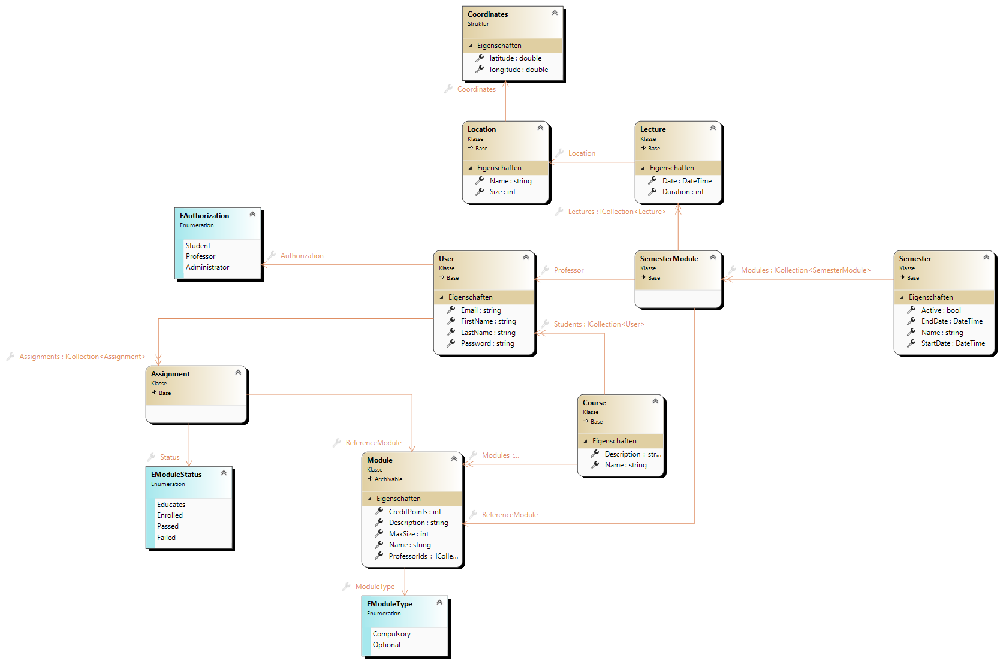

# University

## Setup
1. Open in Visual Studio
2. Install dependencies
3. Add secrets.json

```json
{
  "Jwt": {
    "Key": "Secret Key",
    "Issuer": "The Server",
    "Audience": "The Client"
  },
  "ConnectionString": "Your Azure Cosmos DB Connection String"
}
```

## Entities
| Entity | Description |
| --- | --- |
| `Course` | Stores Users and assigns Compulsory Modules to these. |
| `Location` | Defined with Coordinates and the amount of people it can hold. |
| `Module` | General Module that can be assigned to users or added to a semester. |
| `Semester` | A semester with the modules available in that semester. |
| `User` | Account for all types of users. Including students, professors and administrators. |

## Class Diagram
